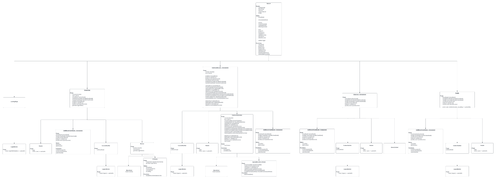
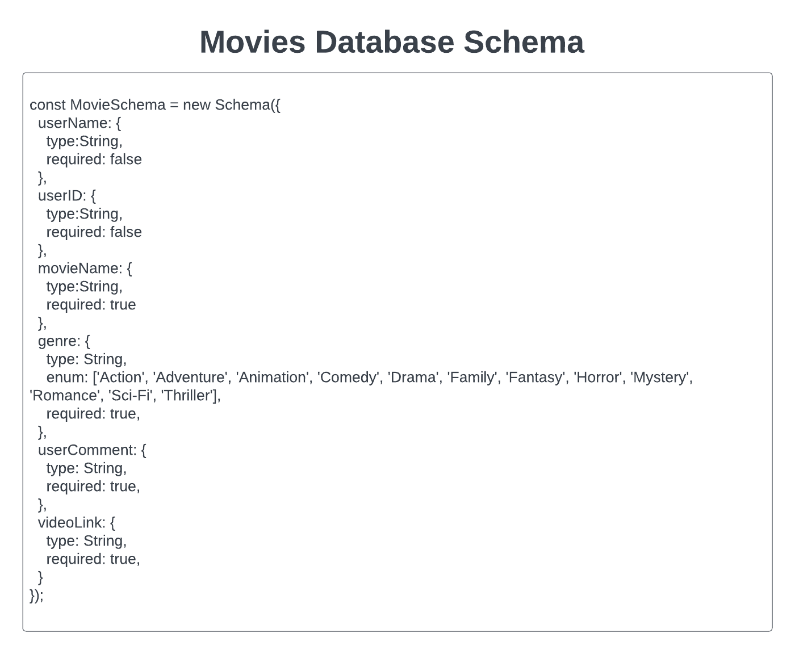
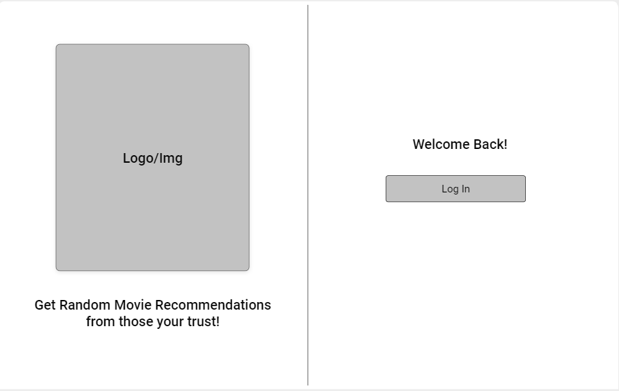
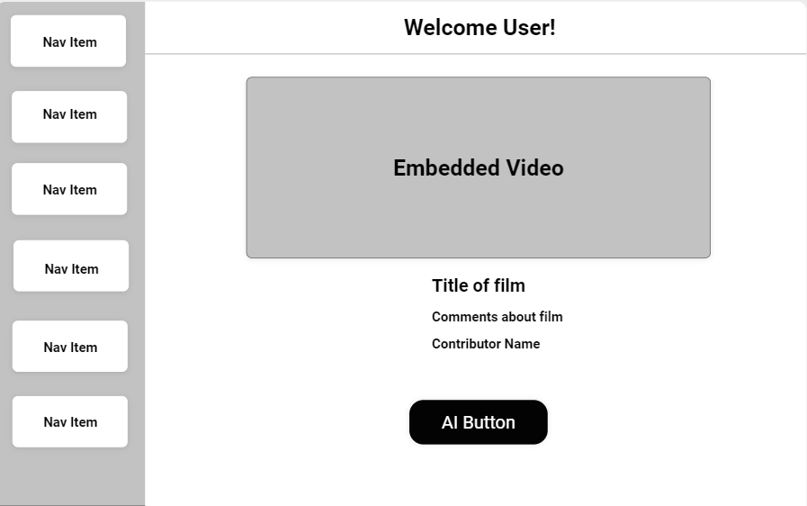
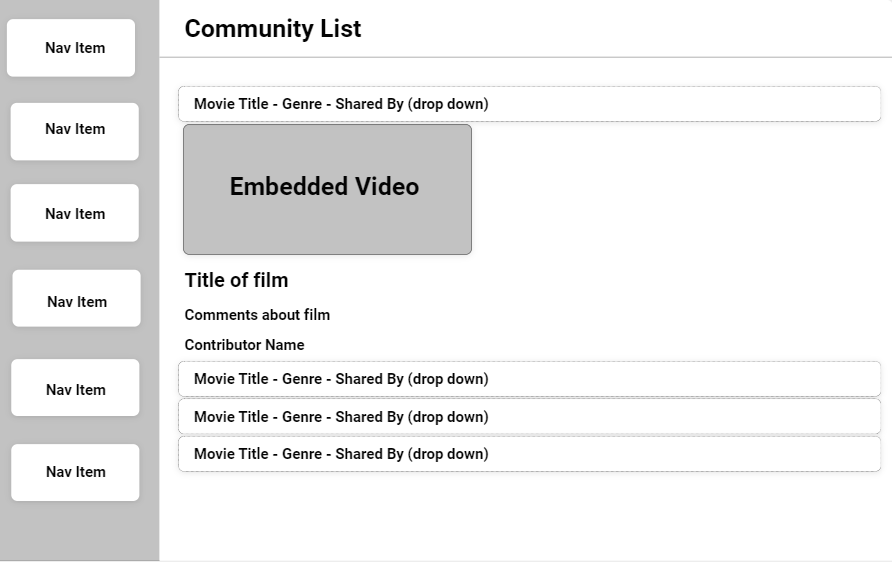
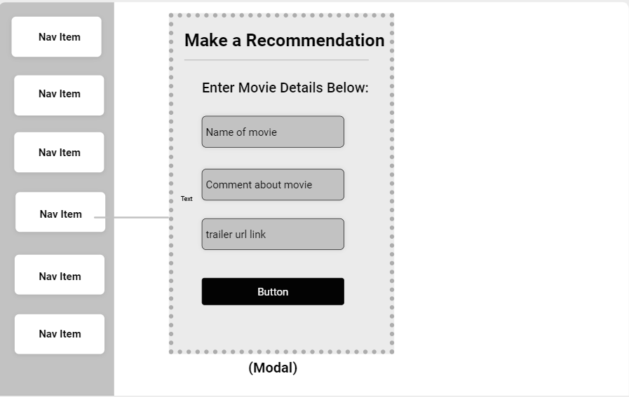
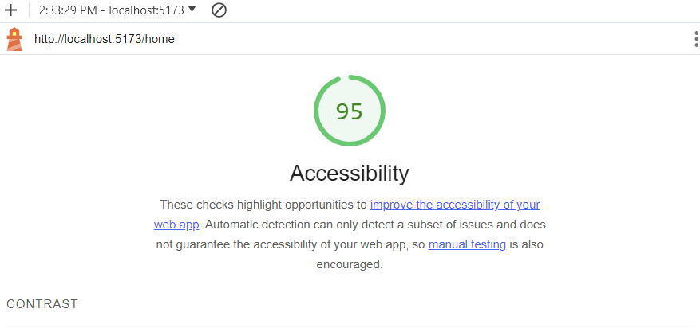

# WWYR? - Community Driven Movie Recommendations

## Team Member(s)

Melo "Melodic" Gonzalez

## Description

Provide users with movie recommendations (complete with YouTube trailer, contributor details, and comments about the movie) from individuals the user knows and trusts. Users will have access to a curated selection of movies handpicked by their own community. Users value personal recommendations when it comes to deciding what movie to watch.

## Getting Started

### Requirements

For development, you will only need Node.js installed on your environment.
And please use the appropriate [Editorconfig](http://editorconfig.org/) plugin for your Editor (not mandatory).

#### Node

[Node](http://nodejs.org/) is really easy to install & now include [NPM](https://npmjs.org/).
You should be able to run the following command after the installation procedure
below.

    $ node --version
    v0.10.24

    $ npm --version
    1.3.21

### Install

    git clone https://github.com/ORG/PROJECT.git
    cd PROJECT
    npm install

### Configure app

Any environment configuration steps.

### Start & watch

    npm run dev
    npm start

### Simple build for production

    npm run build

## Architecture

### Languages & tools

## Change Log

### 12-11-2023 thru 12-13-2023

12-13-2023 2:30pm - Styling and retrieve by userID

Name of feature: Retrieve by userID instead of email

Estimate of time needed to complete: 3 hour

Actual time needed to complete: 7 hours

### 12-10-2023

12-10-2023 10:00am - Sort ability in community list

Name of feature: Ability to sort movies

Estimate of time needed to complete: 3 hour

Start time: 2:30 pm

Finish time: 4:30 pm

Actual time needed to complete: 7 hours

### 12-9-2023

12-9-2023 10:00am - Retrieve AI movie suggestions

Name of feature: Ability to retrieve AI movie suggestions

Estimate of time needed to complete: 5 hour

Start time: 6:30 am

Finish time: 8:30 am

Actual time needed to complete: 7 hours

### 12-8-2023

12-8-2023 10:00am - Retrieve AI movie suggestions

Name of feature: Ability to retrieve AI movie suggestions

Estimate of time needed to complete: 5 hour

Start time: 10:00 am

Finish time: 3:00 pm

Actual time needed to complete:  in progress

12-8-2023 10:00am - Sort movies

Name of feature: Sort Movies community list

Estimate of time needed to complete: 5 hour

Start time: 7:00 am

Finish time: 10:00 am

Actual time needed to complete: 3 hours

### 12-7-2023

12-7-2023 4:30pm - Set up UPDATE, DELETE, POST via user Authentication

Name of feature: Ability to UPDATE, DELETE, POST via user Authentication

Estimate of time needed to complete: 5 hour

Start time: 8:00 am

Finish time: 1:00 pm

Actual time needed to complete: 5 hours

### 12-6-2023

12-6-2023 4:30pm - Set up UPDATE, DELETE, POST

Name of feature: Ability to UPDATE, DELETE, POST

Estimate of time needed to complete: 5 hour

Start time: 8:00 am

Finish time: 4:30 am

Actual time needed to complete: 8 hours

### 12-5-2023

12-5-2023 9:15am - Set up GET

Name of feature: Ability to GET

Estimate of time needed to complete: 1 hour

Start time: 9:00 am

Finish time: 3:30 am

Actual time needed to complete: 30 minutes

### 11-30-2023 thru 12-4-2023

11-30-2023 11am - Set up basic layouts and styling

Name of feature: Set up basic shell

Estimate of time needed to complete: 2 hours

Actual time needed to complete: 5 hours

## Links

### GitHub Project Management Board

[GitHub Project Management Board](https://github.com/orgs/WWYR-Community-Movie-Recommendations/projects/2/views/1)  

### Domain Model (image)

### Database Schema (image)

### WireFrames (images)

  

  

  

### Team Agreement

[Team Agreement](TeamAgreement.md)

### Lighthouse Scores

LightHouse Score 11-07-2023 
